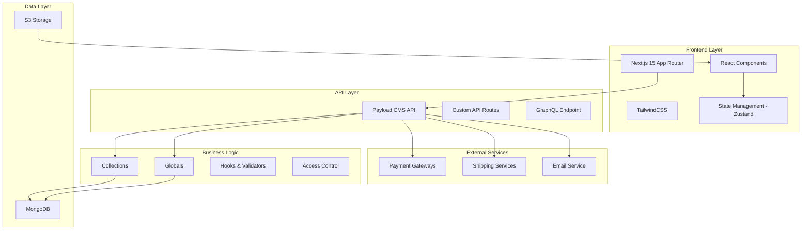
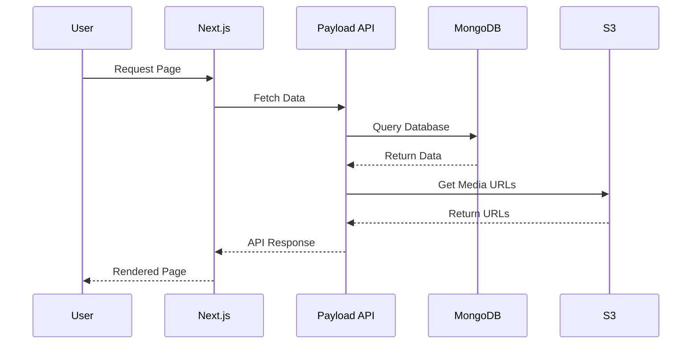
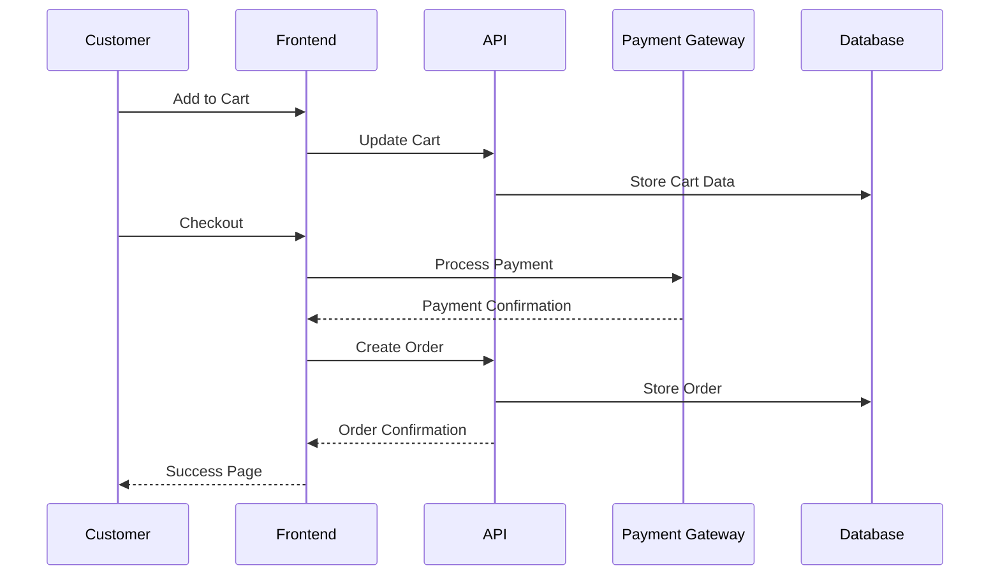
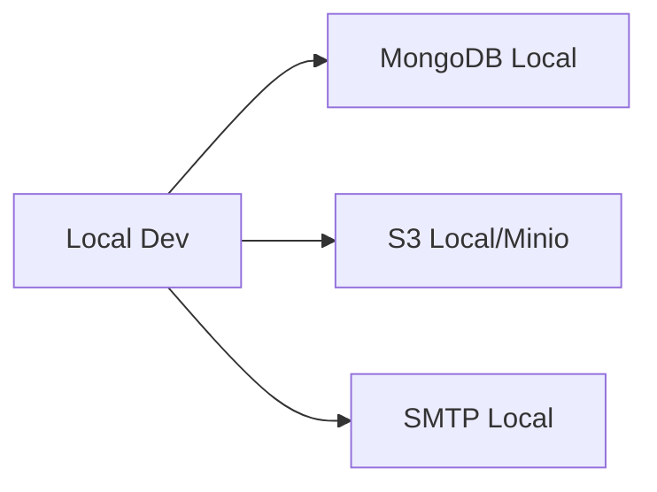
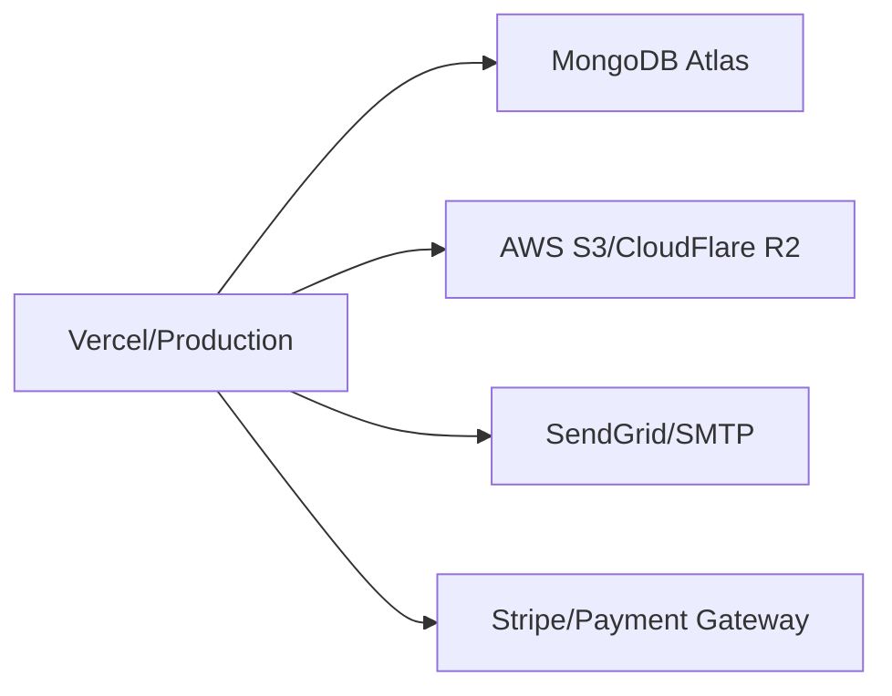

# Architecture Overview

## High-Level Architecture

The Payload Ecommerce Template follows a modern, modular architecture built on Next.js 15 and PayloadCMS. The system is designed for scalability, maintainability, and extensibility.



## Core Technologies

### Frontend Stack

#### Next.js 15 with App Router

- **Server-Side Rendering (SSR)**: For SEO and performance
- **Static Site Generation (SSG)**: For fast page loads
- **API Routes**: For backend functionality
- **Image Optimization**: Built-in image optimization
- **Internationalization**: Multi-language support with next-intl

#### React 19

- **Server Components**: For performance optimization
- **Suspense**: For loading states
- **Error Boundaries**: For error handling
- **Hooks**: Custom hooks for business logic

#### TailwindCSS 4.x

- **Utility-First**: Rapid development
- **Responsive Design**: Mobile-first approach
- **Dark Mode**: Theme switching support
- **Custom Components**: Design system components

### Backend Stack

#### PayloadCMS 3.47

- **Headless CMS**: API-first approach
- **Admin Panel**: Auto-generated admin interface
- **TypeScript**: Full type safety
- **Extensible**: Custom fields and components
- **Authentication**: Built-in user management

#### MongoDB with Mongoose

- **NoSQL Database**: Flexible document storage
- **Indexing**: Optimized queries
- **Aggregation**: Complex data operations
- **Transactions**: ACID compliance

#### S3 Storage

- **File Management**: Images and documents
- **CDN Integration**: Fast global delivery
- **Scalability**: Unlimited storage

## Project Structure

### Directory Organization

```
src/
├── access/                 # Access control patterns
│   ├── anyone.ts          # Public access
│   ├── authenticated.ts   # Authenticated users only
│   └── authenticatedOrPublished.ts
├── admin/                 # Admin panel customizations
│   └── translations/      # Custom admin translations
├── app/                   # Next.js App Router
│   ├── (frontend)/       # Public routes
│   │   ├── [locale]/     # Internationalized routes
│   │   └── (sitemaps)/   # SEO sitemaps
│   └── (payload)/        # Admin panel routes
├── blocks/               # Content blocks
│   ├── (ecommerce)/     # Ecommerce-specific blocks
│   ├── Accordion/       # Content blocks
│   ├── Banner/
│   ├── Carousel/
│   └── ...
├── collections/          # Data models
│   ├── (ecommerce)/     # Ecommerce collections
│   │   ├── Customers/
│   │   ├── Orders/
│   │   ├── Products/
│   │   └── ...
│   ├── Pages/
│   ├── Posts/
│   └── Media/
├── components/           # React components
│   ├── (ecommerce)/     # Ecommerce components
│   ├── ui/              # Base UI components
│   └── ...
├── fields/              # Reusable field definitions
├── globals/             # Global configurations
│   └── (ecommerce)/     # Shop settings
├── hooks/               # Custom React hooks
├── lib/                 # Utility libraries
├── providers/           # Context providers
├── stores/              # State management
└── utilities/           # Helper functions
```

## Design Patterns

### 1. Collection-Based Architecture

Each major entity is defined as a PayloadCMS collection:

```typescript
// Example: Product Collection
export const Products: CollectionConfig = {
  slug: "products",
  access: {
    read: anyone,
    create: authenticated,
    update: authenticated,
    delete: authenticated,
  },
  fields: [
    // Field definitions
  ],
  hooks: {
    // Lifecycle hooks
  }
}
```

### 2. Global Configuration Pattern

Site-wide settings are managed through globals:

```typescript
// Example: Shop Settings
export const ShopSettings: GlobalConfig = {
  slug: "shopSettings",
  access: { read: () => true },
  fields: [
    // Configuration fields
  ]
}
```

### 3. Component Composition

Reusable blocks for flexible content:

```typescript
// Content blocks are composable
const blocks = [
  CallToAction,
  Content,
  MediaBlock,
  Archive,
  Carousel
];
```

### 4. State Management with Zustand

Simple, scalable state management:

```typescript
// Cart store example
export const useCartStore = create<CartState>((set, get) => ({
  items: [],
  addItem: (item) => set((state) => ({
    items: [...state.items, item]
  })),
  // Other actions
}));
```

## Data Flow

### 1. Request Lifecycle



### 2. Ecommerce Flow



## Security Architecture

### Access Control

The system implements role-based access control:

```typescript
// Access patterns
export const accessPatterns = {
  anyone: () => true,
  authenticated: ({ req }) => Boolean(req.user),
  adminOnly: ({ req }) => req.user?.role === 'admin'
};
```

### Data Validation

Multiple layers of validation:

1. **Client-side**: React Hook Form with Zod schemas
2. **API-level**: Payload field validation
3. **Database-level**: Mongoose schema validation

### Authentication

- **JWT Tokens**: Secure session management
- **Password Hashing**: bcrypt for secure storage
- **Email Verification**: Account verification flow
- **OAuth Support**: Optional social login

## Performance Optimization

### Frontend Optimizations

1. **Server Components**: Reduce client-side JavaScript
2. **Image Optimization**: Next.js Image component
3. **Code Splitting**: Dynamic imports
4. **Caching**: Static generation and revalidation

### Backend Optimizations

1. **Database Indexing**: Optimized queries
2. **Aggregation Pipelines**: Efficient data processing
3. **Connection Pooling**: Database connections
4. **CDN Integration**: Static asset delivery

### State Management

1. **Zustand**: Lightweight state management
2. **Local Storage**: Persistent cart state
3. **SWR Pattern**: Data fetching and caching

## Internationalization (i18n)

### Multi-language Support

```typescript
// Routing configuration
export const routing = defineRouting({
  locales: ['en', 'pl'],
  defaultLocale: 'en',
  pathnames: {
    '/': '/',
    '/product/[slug]': {
      en: '/product/[slug]',
      pl: '/produkt/[slug]'
    }
  }
});
```

### Content Localization

- **Database Level**: Localized fields in collections
- **UI Level**: Translation files for interface
- **URL Level**: Localized routes and slugs

## Extensibility

### Adding New Collections

1. Create collection configuration
2. Define fields and access rules
3. Add to main config
4. Generate TypeScript types

### Custom Components

1. Create component in appropriate directory
2. Export from index
3. Use in blocks or pages
4. Add to Storybook (if available)

### API Extensions

1. Add custom endpoints to collections
2. Implement business logic
3. Add proper error handling
4. Document API changes

## Deployment Architecture

### Development Environment



### Production Environment



## Monitoring and Logging

### Error Handling

1. **Client-side**: Error boundaries
2. **Server-side**: Try-catch blocks
3. **API-level**: Standardized error responses
4. **Database-level**: Connection error handling

### Logging Strategy

1. **Development**: Console logging
2. **Production**: Structured logging
3. **Error Tracking**: Integration ready for Sentry
4. **Performance**: Next.js analytics ready

## Best Practices

### Code Organization

1. **Separation of Concerns**: Clear module boundaries
2. **Reusability**: Shared components and utilities
3. **Type Safety**: Full TypeScript coverage
4. **Documentation**: Inline and external docs

### Performance

1. **Lazy Loading**: Dynamic imports
2. **Memoization**: React.memo and useMemo
3. **Optimization**: Bundle analysis
4. **Caching**: Strategic cache usage

### Security

1. **Input Validation**: All user inputs
2. **Authentication**: Secure session management
3. **Authorization**: Role-based access
4. **Data Protection**: Sensitive data handling

## Future Considerations

### Scalability

1. **Database Sharding**: For large datasets
2. **Microservices**: Service separation
3. **CDN**: Global content delivery
4. **Caching Layers**: Redis integration

### Features

1. **Real-time**: WebSocket integration
2. **Analytics**: Advanced tracking
3. **AI/ML**: Recommendation systems
4. **Mobile**: Progressive Web App features

This architecture provides a solid foundation for a modern ecommerce platform while maintaining flexibility for future growth and customization.
