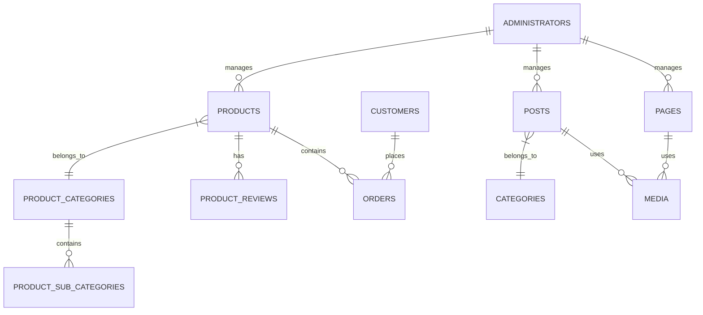
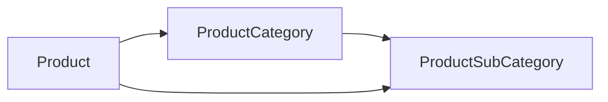
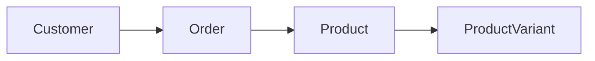
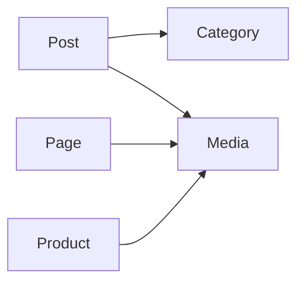

# Database Schema & Collections

## Overview

PayloadCMS collections define the data structure and API for the ecommerce platform. Each collection represents a content type with fields, relationships, and business logic.

## Collection Architecture



## Core Collections

### 1. Pages Collection

**Purpose**: Manages static pages like Home, About, Contact, etc.

**Location**: `src/collections/Pages/index.ts`

**Key Features**:

- Flexible layout with content blocks
- SEO optimization
- Live preview
- Multi-language support
- Draft/publish workflow

**Fields Structure**:

```typescript
interface Page {
  id: string;
  title: string;               // Localized
  slug: string;
  hero?: Hero;                 // Hero section configuration
  layout: Block[];             // Content blocks array
  meta: {
    title?: string;            // SEO title
    description?: string;      // SEO description
    image?: Media;             // OG image
  };
  publishedAt?: Date;
  createdAt: Date;
  updatedAt: Date;
}
```

**Available Blocks**:

- CallToAction
- Content (Rich text)
- MediaBlock
- Archive (Post listings)
- FormBlock
- Carousel
- Accordion
- Hotspot (ecommerce)

**Access Control**:

- Read: Public (published) or authenticated (drafts)
- Create/Update/Delete: Authenticated users only

### 2. Posts Collection

**Purpose**: Blog posts and news articles

**Location**: `src/collections/Posts/index.ts`

**Key Features**:

- Rich text content
- Category organization
- Featured images
- Author management
- Related posts

**Fields Structure**:

```typescript
interface Post {
  id: string;
  title: string;               // Localized
  slug: string;
  content?: RichText;          // Main content
  excerpt?: string;            // Short description
  categories?: Category[];     // Post categories
  featuredImage?: Media;
  author?: Administrator;
  meta: SEOMeta;
  publishedAt?: Date;
  createdAt: Date;
  updatedAt: Date;
}
```

### 3. Media Collection

**Purpose**: File and image management

**Location**: `src/collections/Media.ts`

**Key Features**:

- Multiple image sizes
- Alt text and captions
- S3 storage integration
- Focal point selection

**Fields Structure**:

```typescript
interface Media {
  id: string;
  filename: string;
  mimeType: string;
  filesize: number;
  width?: number;
  height?: number;
  alt: string;                 // Localized, required
  caption?: RichText;          // Localized
  url: string;
  sizes: {
    thumbnail?: ImageSize;
    square?: ImageSize;
    small?: ImageSize;
    medium?: ImageSize;
    large?: ImageSize;
    xlarge?: ImageSize;
    og?: ImageSize;
  };
  focalX?: number;
  focalY?: number;
  createdAt: Date;
  updatedAt: Date;
}
```

**Image Sizes**:

- `thumbnail`: 300px width
- `square`: 500x500px
- `small`: 600px width
- `medium`: 900px width
- `large`: 1400px width
- `xlarge`: 1920px width
- `og`: 1200x630px (for social sharing)

### 4. Categories Collection

**Purpose**: Content categorization for posts

**Location**: `src/collections/Categories.ts`

**Fields Structure**:

```typescript
interface Category {
  id: string;
  title: string;               // Localized
  slug: string;
  description?: string;        // Localized
  createdAt: Date;
  updatedAt: Date;
}
```

### 5. Administrators Collection

**Purpose**: Admin user management

**Location**: `src/collections/Administrators/index.ts`

**Key Features**:

- Authentication system
- Role-based access
- Password reset
- Email verification

**Fields Structure**:

```typescript
interface Administrator {
  id: string;
  email: string;              // Unique, required
  password: string;           // Hashed
  firstName?: string;
  lastName?: string;
  roles?: string[];
  loginAttempts?: number;
  lockUntil?: Date;
  createdAt: Date;
  updatedAt: Date;
}
```

## Ecommerce Collections

### 1. Products Collection

**Purpose**: Product catalog management

**Location**: `src/collections/(ecommerce)/Products/index.ts`

**Key Features**:

- Product variants (colors, sizes)
- Multiple pricing (multi-currency)
- Stock management
- Category organization
- Product details and specifications

**Fields Structure**:

```typescript
interface Product {
  id: string;
  title: string;               // Localized, required
  slug: string;
  description?: RichText;      // Localized
  images: Media[];             // Required, min 1, max 10

  // Variant Configuration
  enableVariants?: boolean;
  enableVariantPrices?: boolean;
  enableVariantWeights?: boolean;
  variantsType?: 'sizes' | 'colors' | 'colorsAndSizes';

  // Color Options (if variants enabled)
  colors?: Array<{
    label: string;             // Localized
    slug: string;
    colorValue?: string;       // Hex color
  }>;

  // Size Options (if variants enabled)
  sizes?: Array<{
    label: string;             // Localized
    slug: string;
  }>;

  // Product Variants
  variants?: Array<{
    size?: string;
    color?: string;
    variantSlug: string;       // Auto-generated
    image?: Media;
    stock: number;             // Required
    weight?: number;           // If enableVariantWeights
    pricing?: Array<{          // If enableVariantPrices
      value: number;
      currency: Currency;
    }>;
  }>;

  // Product Details (if no variants or global settings)
  categoriesArr?: Array<{
    category: ProductCategory;
    subcategories?: ProductSubCategory[];
  }>;
  stock?: number;              // If no variants
  weight?: number;             // If no variant weights
  pricing?: Array<{           // If no variant prices
    value: number;
    currency: Currency;
  }>;
  bought?: number;             // Sales counter

  // Additional Details
  details?: Array<{
    title: string;             // Localized
    content: RichText;         // Localized
  }>;

  createdAt: Date;
  updatedAt: Date;
}
```

**Variant Logic**:

- Products can have variants based on colors, sizes, or both
- Each variant has independent stock and optional pricing
- Variant slugs are auto-generated (e.g., "red-large", "blue-small")
- First image is used as variant image if no specific image is set

### 2. Product Categories Collection

**Purpose**: Product organization

**Location**: `src/collections/(ecommerce)/ProductCategories/index.ts`

**Fields Structure**:

```typescript
interface ProductCategory {
  id: string;
  title: string;               // Localized
  slug: string;
  description?: string;        // Localized
  image?: Media;
  createdAt: Date;
  updatedAt: Date;
}
```

### 3. Product Sub Categories Collection

**Purpose**: Product sub-organization

**Location**: `src/collections/(ecommerce)/ProductSubCategories/index.ts`

**Fields Structure**:

```typescript
interface ProductSubCategory {
  id: string;
  title: string;               // Localized
  slug: string;
  category: ProductCategory;   // Parent category
  description?: string;        // Localized
  createdAt: Date;
  updatedAt: Date;
}
```

### 4. Customers Collection

**Purpose**: Customer management and authentication

**Location**: `src/collections/(ecommerce)/Customers/index.ts`

**Key Features**:

- Customer authentication
- Multiple shipping addresses
- Order history integration
- Cart and wishlist storage

**Fields Structure**:

```typescript
interface Customer {
  id: string;
  email: string;              // Unique, required
  password: string;           // Hashed
  firstName?: string;
  lastName?: string;
  fullName?: string;          // Auto-generated
  birthDate?: Date;
  lastBuyerType?: 'individual' | 'company';

  // Shipping Addresses
  shippings?: Array<{
    name: string;
    address: string;
    city: string;
    country: string;
    region: string;
    postalCode: string;
    phone: string;
    email: string;
    default?: boolean;
  }>;

  // Related Data
  orders?: Order[];           // Join relationship
  cart?: JSON;                // Cart state storage
  wishlist?: JSON;            // Wishlist storage

  // Authentication
  loginAttempts?: number;
  lockUntil?: Date;
  verified?: boolean;

  createdAt: Date;
  updatedAt: Date;
}
```

### 5. Orders Collection

**Purpose**: Order management and fulfillment

**Location**: `src/collections/(ecommerce)/Orders/index.ts`

**Key Features**:

- Complete order lifecycle
- Payment tracking
- Shipping integration
- Invoice management
- Stock management integration

**Fields Structure**:

```typescript
interface Order {
  id: string;                 // Auto-generated unique ID
  customer?: Customer;
  date?: Date;                // Order date
  extractedFromStock?: boolean; // Stock management flag

  // Order Products
  products: Array<{
    product?: Product;
    productName?: string;     // Cached product name
    isFromAPI?: boolean;      // API vs manual order
    color?: string;
    size?: string;
    variantSlug?: string;
    quantity: number;
    price?: number;           // Price per unit
    autoprice?: boolean;      // Auto-calculated price
    priceTotal: number;       // Total for this product
  }>;

  // Invoice Information
  invoice?: {
    isCompany?: boolean;
    name?: string;
    tin?: string;             // Tax ID (for companies)
    address?: string;
    city?: string;
    country?: string;
    region?: string;
    postalCode?: string;
  };

  // Shipping Information
  shippingAddress: {
    name: string;
    address: string;
    city: string;
    country: string;
    region: string;
    postalCode: string;
    email: string;
    phone: string;
    pickupPointID?: string;   // For InPost pickup
    pickupPointAddress?: string;
  };

  // Label Printing (for courier integration)
  printLabel?: {
    packageNumber?: string;
    width?: number;
    height?: number;
    length?: number;
    weight?: number;
    dimension?: string;
  };

  // Order Details
  orderDetails: {
    total: number;            // Subtotal (without shipping)
    shippingCost: number;
    totalWithShipping: number;
    currency: Currency;
    amountPaid?: number;
    shipping?: string;        // Shipping method
    transactionID?: string;   // Payment transaction ID
    status: OrderStatus;
    shippingDate?: Date;
    trackingNumber?: string;
    orderNote?: string;
  };

  createdAt: Date;
  updatedAt: Date;
}

type OrderStatus =
  | 'pending'
  | 'paid'
  | 'unpaid'
  | 'processing'
  | 'shipped'
  | 'completed'
  | 'cancelled'
  | 'returned';
```

**Order Hooks**:

- `generateID`: Auto-generates unique order ID
- `sendStatusEmail`: Sends email on status change
- `restoreStocks`: Restores stock on cancellation

**Order Endpoints**:

- `/api/orders/revenue`: Revenue analytics
- `/api/orders/count`: Order count analytics
- `/api/orders/chart`: Chart data for dashboard

### 6. Product Reviews Collection

**Purpose**: Customer product reviews

**Location**: `src/collections/(ecommerce)/ProductReviews/index.ts`

**Fields Structure**:

```typescript
interface ProductReview {
  id: string;
  product: Product;
  customer?: Customer;
  customerName?: string;      // For non-registered customers
  customerEmail?: string;
  rating: number;             // 1-5 stars
  title?: string;
  content?: string;
  verified?: boolean;         // Verified purchase
  helpful?: number;           // Helpful votes
  status?: 'pending' | 'approved' | 'rejected';
  createdAt: Date;
  updatedAt: Date;
}
```

## Collection Relationships

### Product-Category Relationship



### Order-Product-Customer Relationship



### Content Relationships



## Access Control Patterns

### Public Access (anyone)

- Media (read)
- Products (read)
- Pages (read, published only)
- Posts (read, published only)

### Authenticated Access

- Customers (own data only)
- Orders (own orders only)
- Pages (drafts, if author)
- Posts (drafts, if author)

### Admin Access (authenticated)

- All collections (full CRUD)
- User management
- System settings

## Field Types Reference

### Custom Fields

1. **Currency Field**: `src/fields/currencyField.ts`
   - Multi-currency support
   - Dropdown selection

2. **Slug Field**: `src/fields/slug/index.ts`
   - Auto-generation from title
   - Manual override support
   - URL-safe formatting

3. **Rich Text**: Uses Lexical editor
   - Blocks support
   - Media embedding
   - Link management

### Localized Fields

Fields marked as `localized: true` support multiple languages:

- `title` (in most collections)
- `description`
- `content`
- `alt` text for media

### Required vs Optional

**Always Required**:

- `title` in all content collections
- `email` in user collections
- `slug` for public-facing content
- `quantity` and `priceTotal` in orders

**Commonly Optional**:

- `description` fields
- `meta` information
- Variant-specific fields (conditional)

## Indexes and Performance

### Automatic Indexes

- `id` fields (primary keys)
- `slug` fields (for URL lookups)
- `email` fields (for authentication)

### Custom Indexes

- Product search fields
- Order status and date
- Customer email verification

### Query Optimization

- Use `select` to limit returned fields
- Implement pagination for large datasets
- Use `populate` judiciously for relationships

## Migration and Seeding

### Data Migration

PayloadCMS handles schema migrations automatically, but for major changes:

1. Backup database
2. Test migration in development
3. Plan rollback strategy
4. Monitor after deployment

### Seeding Data

For development and testing:

```bash
# Generate sample data
pnpm payload seed

# Reset database
pnpm payload db:reset
```

## Collection Hooks

### Common Hooks

- `beforeChange`: Data validation and transformation
- `afterChange`: Side effects (emails, cache invalidation)
- `beforeDelete`: Cleanup and validation
- `afterDelete`: Cascade operations

### Example Hook Usage

```typescript
hooks: {
  beforeChange: [
    ({ data, operation }) => {
      if (operation === 'create') {
        data.slug = generateSlug(data.title);
      }
      return data;
    }
  ],
  afterChange: [
    async ({ doc, operation }) => {
      if (operation === 'create') {
        await sendNotificationEmail(doc);
      }
    }
  ]
}
```

This collection structure provides a robust foundation for ecommerce operations while maintaining flexibility for customization and extension.
