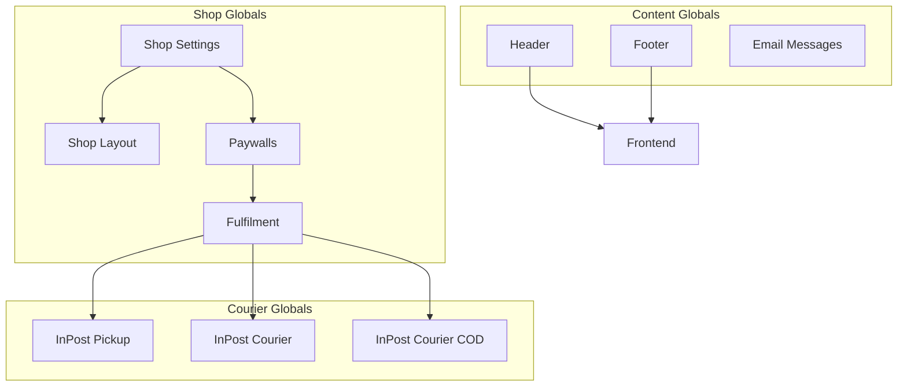
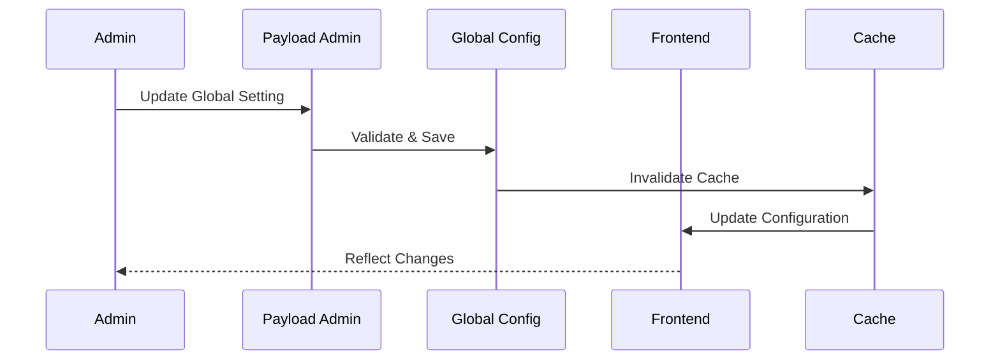

# Global Configurations

## Overview

PayloadCMS globals define site-wide settings and configurations that control the behavior and appearance of the ecommerce platform. Unlike collections, globals are singleton configurations that exist once per site.

## Global Architecture



## Content Management Globals

### 1. Header Global

**Purpose**: Site-wide header configuration including navigation, logo, and user interface elements.

**Location**: `src/globals/Header/config.ts`

**Key Features**:

- Multi-level navigation
- Logo management
- Search functionality
- User account integration
- Mobile responsive design

**Configuration Structure**:

```typescript
interface HeaderGlobal {
  logo?: Media;
  nav?: {
    items: Array<{
      type: 'link' | 'page' | 'product' | 'category';
      label: string;              // Localized
      page?: Page;
      product?: Product;
      category?: ProductCategory;
      url?: string;
      children?: NavigationItem[];
    }>;
  };
  actions?: {
    theme?: boolean;            // Theme switcher
    search?: boolean;           // Search toggle
    cart?: boolean;             // Cart icon
    account?: boolean;          // Account menu
  };
}
```

**Component**: `src/globals/Header/Component.tsx`

**Variants**:

- Desktop navigation with dropdowns
- Mobile hamburger menu
- Sticky header on scroll

### 2. Footer Global

**Purpose**: Site-wide footer configuration with links, contact information, and legal pages.

**Location**: `src/globals/Footer/config.ts`

**Configuration Structure**:

```typescript
interface FooterGlobal {
  logo?: Media;
  columns?: Array<{
    title: string;              // Localized
    items: Array<{
      type: 'link' | 'page';
      label: string;            // Localized
      page?: Page;
      url?: string;
      newTab?: boolean;
    }>;
  }>;
  social?: Array<{
    platform: 'facebook' | 'twitter' | 'instagram' | 'linkedin';
    url: string;
  }>;
  copyright?: string;           // Localized
  legal?: Array<{
    page: Page;
    label: string;              // Localized
  }>;
}
```

**Component**: `src/globals/Footer/Component.tsx`

### 3. Email Messages Global

**Purpose**: SMTP configuration and email template settings.

**Location**: `src/globals/EmailMessages/config.ts`

**Configuration Structure**:

```typescript
interface EmailMessagesGlobal {
  smtp: {
    host: string;
    port: number;
    secure: boolean;
    user: string;
    password: string;
    fromEmail: string;
    fromName: string;
  };
  templates: {
    orderConfirmation?: {
      subject: string;           // Localized
      template: string;
    };
    orderStatusUpdate?: {
      subject: string;           // Localized
      template: string;
    };
    passwordReset?: {
      subject: string;           // Localized
      template: string;
    };
    accountVerification?: {
      subject: string;           // Localized
      template: string;
    };
  };
}
```

**Email Templates**:

- Order confirmation
- Order status updates
- Password reset
- Account verification
- Welcome emails

## Shop Configuration Globals

### 1. Shop Settings Global

**Purpose**: Core ecommerce configuration including currencies, OAuth, and general shop settings.

**Location**: `src/globals/(ecommerce)/ShopSettings/config.ts`

**Key Features**:

- Multi-currency support
- Currency exchange rates
- OAuth integration toggle
- General shop preferences

**Configuration Structure**:

```typescript
interface ShopSettingsGlobal {
  availableCurrencies: Currency[];  // First is default
  currencyValues: Array<{
    currency: Currency;
    value: number;               // Exchange rate
  }>;
  enableOAuth: boolean;
}

type Currency = 'USD' | 'EUR' | 'GBP' | 'PLN';
```

**Features**:

1. **Multi-Currency Support**:
   - Configure available currencies
   - Set exchange rates
   - Default currency selection
   - Real-time conversion

2. **OAuth Integration**:
   - Enable/disable social login
   - Configure providers
   - Manage authentication flow

3. **Shop Preferences**:
   - Tax settings
   - Shipping zones
   - Default product settings

### 2. Shop Layout Global

**Purpose**: Frontend layout configuration and client panel settings.

**Location**: `src/globals/(ecommerce)/Layout/config.ts`

**Key Features**:

- Product page layouts
- Category page configurations
- Client account panel settings
- Help page content

**Configuration Structure**:

```typescript
interface ShopLayoutGlobal {
  productPage: {
    layout: 'default' | 'wide' | 'minimal';
    showReviews: boolean;
    showRelated: boolean;
    showDescription: boolean;
    imageGallery: 'carousel' | 'grid' | 'stack';
  };
  categoryPage: {
    layout: 'grid' | 'list';
    itemsPerPage: number;
    showFilters: boolean;
    showSorting: boolean;
  };
  clientPanel: {
    type: 'withSidebar';        // Currently only option
    help: {
      title: string;            // Localized
      content: RichText;        // Localized
    };
  };
}
```

**Layout Options**:

1. **Product Page Layouts**:
   - Default: Standard product layout
   - Wide: Full-width images
   - Minimal: Clean, focused design

2. **Category Page Layouts**:
   - Grid: Product grid view
   - List: Detailed list view

3. **Client Panel**:
   - Sidebar navigation
   - Account management
   - Order history
   - Help documentation

### 3. Paywalls Global

**Purpose**: Payment gateway configuration and settings.

**Location**: `src/globals/(ecommerce)/Paywalls/config.ts`

**Supported Payment Gateways**:

- Stripe
- Autopay (Polish payment gateway)
- Przelewy24 (Polish payment system)

**Configuration Structure**:

```typescript
interface PaywallsGlobal {
  paywall: 'stripe' | 'autopay' | 'p24';

  stripe?: {
    publishableKey: string;
    secretKey: string;
    webhookSecret: string;
    currency: Currency;
    collectBillingAddress: boolean;
  };

  autopay?: {
    gatewayId: string;
    hashKey: string;
    serviceId: string;
    environment: 'sandbox' | 'production';
  };

  p24?: {
    merchantId: string;
    posId: string;
    crcKey: string;
    environment: 'sandbox' | 'production';
  };
}
```

**Payment Flow**:

1. **Stripe Integration**:

   ```typescript
   // Example Stripe configuration
   {
     paywall: 'stripe',
     stripe: {
       publishableKey: 'pk_test_...',
       secretKey: 'sk_test_...',
       webhookSecret: 'whsec_...',
       currency: 'USD',
       collectBillingAddress: true
     }
   }
   ```

2. **Autopay Integration** (Polish market):
   - Gateway ID configuration
   - Hash key for security
   - Service ID for transactions

3. **Przelewy24 Integration** (Polish market):
   - Merchant ID setup
   - POS ID configuration
   - CRC key for validation

### 4. Fulfilment Global

**Purpose**: Order fulfillment and inventory management settings.

**Location**: `src/globals/(ecommerce)/Fulfilment/index.ts`

**Configuration Structure**:

```typescript
interface FulfilmentGlobal {
  inventory: {
    trackStock: boolean;
    allowBackorders: boolean;
    lowStockThreshold: number;
    outOfStockThreshold: number;
  };
  orders: {
    autoConfirm: boolean;
    autoShip: boolean;
    requirePayment: boolean;
    holdDuration: number;        // Days
  };
  notifications: {
    lowStock: boolean;
    newOrder: boolean;
    shipment: boolean;
  };
}
```

**Features**:

1. **Inventory Management**:
   - Stock tracking
   - Backorder handling
   - Stock level alerts
   - Automatic stock updates

2. **Order Processing**:
   - Auto-confirmation
   - Payment requirements
   - Shipping automation
   - Hold periods

3. **Notifications**:
   - Low stock alerts
   - New order notifications
   - Shipping confirmations

## Courier Integration Globals

### 1. InPost Pickup Global

**Purpose**: Configuration for InPost pickup point deliveries.

**Location**: `src/globals/(ecommerce)/Couriers/InPostPickup/config.ts`

**Configuration Structure**:

```typescript
interface InPostPickupGlobal {
  enabled: boolean;
  apiKey: string;
  environment: 'sandbox' | 'production';
  defaultDimensions: {
    width: number;
    height: number;
    length: number;
    weight: number;
  };
  pricing: Array<{
    currency: Currency;
    price: number;
    freeShippingThreshold?: number;
  }>;
  availableCountries: string[];
}
```

**Features**:

- Pickup point selection
- Package dimensions
- Pricing configuration
- Country availability

### 2. InPost Courier Global

**Purpose**: Configuration for InPost courier deliveries.

**Location**: `src/globals/(ecommerce)/Couriers/InPostCourier/config.ts`

**Configuration Structure**:

```typescript
interface InPostCourierGlobal {
  enabled: boolean;
  apiKey: string;
  environment: 'sandbox' | 'production';
  services: Array<{
    type: 'standard' | 'express' | 'weekend';
    name: string;              // Localized
    pricing: Array<{
      currency: Currency;
      price: number;
      freeShippingThreshold?: number;
    }>;
  }>;
  insurance: {
    enabled: boolean;
    maxValue: number;
    percentage: number;
  };
}
```

### 3. InPost Courier COD Global

**Purpose**: Configuration for Cash on Delivery services.

**Location**: `src/globals/(ecommerce)/Couriers/InPostCourierCOD/config.ts`

**Configuration Structure**:

```typescript
interface InPostCourierCODGlobal {
  enabled: boolean;
  apiKey: string;
  maxAmount: number;
  commission: {
    percentage: number;
    minAmount: number;
    maxAmount: number;
  };
  availableCurrencies: Currency[];
}
```

## Global Access Control

### Public Access

- Header (read)
- Footer (read)
- Shop Settings (read)
- Shop Layout (read)

### Admin Only

- Email Messages (read/write)
- Paywalls (read/write)
- Fulfilment (read/write)
- Courier configurations (read/write)

## Global Hooks

### Revalidation Hook

All globals use the `revalidateGlobal` hook to clear caches when updated:

```typescript
import { revalidateGlobal } from "@/hooks/revalidateGlobal";

export const SomeGlobal: GlobalConfig = {
  // ... configuration
  hooks: {
    afterChange: [revalidateGlobal],
  },
};
```

### Custom Validation

Globals can include custom validation logic:

```typescript
hooks: {
  beforeChange: [
    ({ data }) => {
      // Custom validation
      if (data.availableCurrencies.length === 0) {
        throw new Error('At least one currency must be selected');
      }
      return data;
    }
  ]
}
```

## Environment-Specific Configurations

### Development Settings

```typescript
// Example development configuration
{
  paywalls: {
    paywall: 'stripe',
    stripe: {
      publishableKey: 'pk_test_...',
      secretKey: 'sk_test_...',
      environment: 'test'
    }
  }
}
```

### Production Settings

```typescript
// Example production configuration
{
  paywalls: {
    paywall: 'stripe',
    stripe: {
      publishableKey: 'pk_live_...',
      secretKey: 'sk_live_...',
      environment: 'live'
    }
  }
}
```

## Configuration Best Practices

### 1. Security

```typescript
// Store sensitive data in environment variables
{
  stripe: {
    secretKey: process.env.STRIPE_SECRET_KEY,
    webhookSecret: process.env.STRIPE_WEBHOOK_SECRET
  }
}
```

### 2. Validation

```typescript
// Validate currency arrays
{
  validation: (data) => {
    if (!data.availableCurrencies?.length) {
      return 'At least one currency must be selected';
    }
    return true;
  }
}
```

### 3. Localization

```typescript
// Use localized fields for user-facing content
{
  name: 'title',
  type: 'text',
  localized: true,
  required: true
}
```

### 4. Conditional Fields

```typescript
// Show fields based on other selections
{
  admin: {
    condition: (data) => data.paywall === 'stripe'
  }
}
```

## Global Configuration Flow



## Integration Examples

### 1. Currency Integration

```typescript
// Frontend usage
import { useGlobal } from '@/hooks/useGlobal';

const { data: shopSettings } = useGlobal('shopSettings');
const defaultCurrency = shopSettings?.availableCurrencies?.[0];
```

### 2. Payment Gateway Integration

```typescript
// Payment processing
const { data: paywalls } = useGlobal('paywalls');
const paymentProvider = paywalls?.paywall;

switch (paymentProvider) {
  case 'stripe':
    return initializeStripe(paywalls.stripe);
  case 'autopay':
    return initializeAutopay(paywalls.autopay);
  // ... other providers
}
```

### 3. Email Configuration

```typescript
// Email service setup
const { data: emailConfig } = useGlobal('emailMessages');
const transporter = nodemailer.createTransporter({
  host: emailConfig.smtp.host,
  port: emailConfig.smtp.port,
  secure: emailConfig.smtp.secure,
  auth: {
    user: emailConfig.smtp.user,
    pass: emailConfig.smtp.password
  }
});
```

This global configuration system provides a flexible foundation for managing all site-wide settings while maintaining security and ease of use for administrators.
