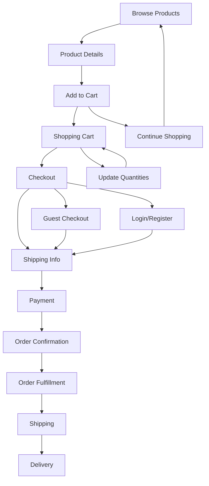
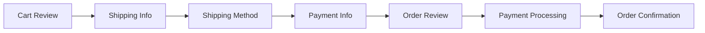
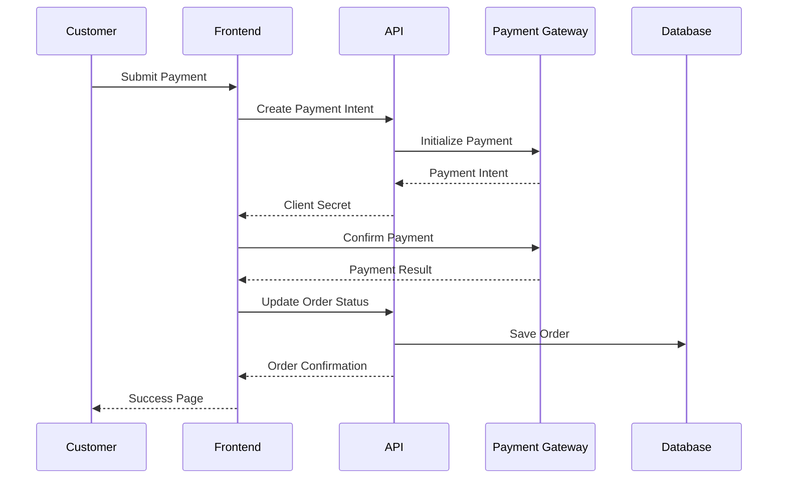
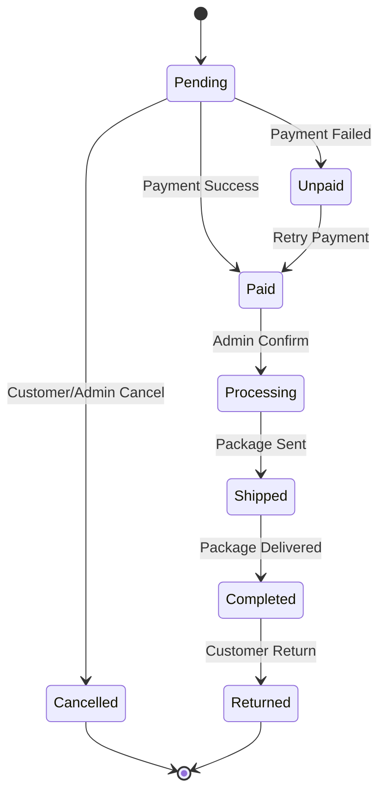

# Ecommerce Features

## Overview

The Payload Ecommerce Template provides a complete ecommerce solution with advanced features for product management, shopping cart, checkout process, payment integration, and order fulfillment.

## Core Ecommerce Flow



## Product Management

### Product Variants System

The template supports flexible product variants with multiple configuration options:

#### Variant Types

1. **Size Only**: Products with different sizes
2. **Color Only**: Products with different colors
3. **Color and Size**: Products with both color and size variations

#### Variant Configuration

```typescript
// Example: T-shirt with colors and sizes
{
  title: "Premium T-Shirt",
  enableVariants: true,
  variantsType: "colorsAndSizes",

  colors: [
    { label: "Red", slug: "red", colorValue: "#FF0000" },
    { label: "Blue", slug: "blue", colorValue: "#0000FF" },
    { label: "Green", slug: "green", colorValue: "#00FF00" }
  ],

  sizes: [
    { label: "Small", slug: "s" },
    { label: "Medium", slug: "m" },
    { label: "Large", slug: "l" },
    { label: "X-Large", slug: "xl" }
  ],

  variants: [
    {
      color: "red",
      size: "m",
      variantSlug: "red-m",
      stock: 50,
      pricing: [{ value: 29.99, currency: "USD" }]
    }
    // ... other variants
  ]
}
```

#### Stock Management

- **Individual Variant Stock**: Each variant maintains separate inventory
- **Global Product Stock**: For products without variants
- **Stock Tracking**: Automatic stock reduction on orders
- **Low Stock Alerts**: Configurable threshold notifications
- **Backorder Support**: Optional backorder handling

#### Pricing Strategy

1. **Variant-Level Pricing**: Different prices per variant
2. **Product-Level Pricing**: Single price for all variants
3. **Multi-Currency Support**: Prices in multiple currencies
4. **Dynamic Pricing**: Exchange rate calculations

### Product Categories

#### Hierarchical Organization

```typescript
// Category structure
{
  category: "Electronics",
  subcategories: [
    "Smartphones",
    "Laptops",
    "Accessories"
  ]
}

// Product categorization
{
  categoriesArr: [
    {
      category: "electronics-id",
      subcategories: ["smartphones-id", "accessories-id"]
    }
  ]
}
```

#### Category Features

- **Nested Categories**: Multi-level category hierarchy
- **Category Images**: Visual category representation
- **SEO Optimization**: Category-specific meta tags
- **Filtering**: Category-based product filtering

### Product Search & Filtering

#### Search Implementation

**Location**: `src/components/search/Component.tsx`

```typescript
export function ProductSearch() {
  const [query, setQuery] = useState('');
  const [filters, setFilters] = useState({
    category: '',
    priceRange: [0, 1000],
    inStock: true
  });

  const { data: products, loading } = useProductSearch({
    query,
    filters,
    sort: 'relevance'
  });

  return (
    <div>
      <SearchInput onChange={setQuery} />
      <ProductFilters filters={filters} onChange={setFilters} />
      <ProductGrid products={products} loading={loading} />
    </div>
  );
}
```

#### Available Filters

- **Text Search**: Product title and description
- **Category Filter**: By category and subcategory
- **Price Range**: Min/max price filtering
- **Stock Status**: In stock vs out of stock
- **Brand Filter**: If brand information available
- **Rating Filter**: Based on product reviews

## Shopping Cart

### Cart State Management

**Location**: `src/stores/CartStore/index.tsx`

```typescript
interface CartItem {
  id: string;
  productId: string;
  variantSlug?: string;
  title: string;
  price: number;
  currency: Currency;
  quantity: number;
  image?: string;
  color?: string;
  size?: string;
  stock: number;
}

interface CartState {
  items: CartItem[];
  isOpen: boolean;
  currency: Currency;

  // Actions
  addItem: (product: Product, variant?: ProductVariant, quantity?: number) => void;
  removeItem: (id: string) => void;
  updateQuantity: (id: string, quantity: number) => void;
  clearCart: () => void;

  // Computed
  totalItems: number;
  subtotal: number;
  total: number;
}
```

### Cart Persistence

- **Local Storage**: Cart persists between sessions
- **User Accounts**: Cart syncs with user account
- **Guest Users**: Anonymous cart handling
- **Cross-Device**: Cart sync for logged-in users

### Cart Features

#### Add to Cart Process

```typescript
const addToCart = (product: Product, selectedVariant?: string) => {
  // Validate stock availability
  const variant = product.variants?.find(v => v.variantSlug === selectedVariant);
  const availableStock = variant?.stock || product.stock || 0;

  if (availableStock < 1) {
    showNotification('Product is out of stock');
    return;
  }

  // Check if item already in cart
  const existingItem = cartItems.find(item =>
    item.productId === product.id &&
    item.variantSlug === selectedVariant
  );

  if (existingItem) {
    updateQuantity(existingItem.id, existingItem.quantity + 1);
  } else {
    addItem(product, variant);
  }

  showNotification('Item added to cart');
};
```

#### Cart Validation

- **Stock Validation**: Prevent over-ordering
- **Price Updates**: Handle price changes
- **Variant Validation**: Ensure variants still exist
- **Currency Conversion**: Real-time currency updates

## Checkout Process

### Multi-Step Checkout



### Checkout Implementation

**Location**: `src/components/(ecommerce)/Checkout/`

```typescript
interface CheckoutState {
  step: 'shipping' | 'payment' | 'review';
  shippingAddress: ShippingAddress;
  billingAddress: BillingAddress;
  paymentMethod: PaymentMethod;
  shippingMethod: ShippingOption;
}

export function CheckoutProcess() {
  const [state, setState] = useState<CheckoutState>({
    step: 'shipping',
    // ... initial state
  });

  const steps = [
    { id: 'shipping', component: ShippingStep },
    { id: 'payment', component: PaymentStep },
    { id: 'review', component: ReviewStep }
  ];

  return (
    <div className="checkout-container">
      <CheckoutSteps currentStep={state.step} />
      <StepComponent {...state} onNext={handleNext} />
    </div>
  );
}
```

### Guest vs Registered Checkout

#### Guest Checkout

- **No Account Required**: Quick checkout process
- **Email Confirmation**: Order tracking via email
- **Optional Registration**: Offer account creation post-purchase

#### Registered User Checkout

- **Saved Addresses**: Pre-filled shipping information
- **Order History**: Previous order access
- **Faster Checkout**: Streamlined repeat purchases
- **Wishlist Integration**: Move items from wishlist

### Address Management

```typescript
interface ShippingAddress {
  name: string;
  address: string;
  city: string;
  region: string;
  postalCode: string;
  country: string;
  phone: string;
  email: string;

  // Special fields for pickup points
  pickupPointID?: string;
  pickupPointAddress?: string;
}
```

## Payment Integration

### Supported Payment Gateways

#### 1. Stripe Integration

**Configuration**: Global Paywalls setting

```typescript
// Stripe setup
const stripe = loadStripe(process.env.NEXT_PUBLIC_STRIPE_PUBLISHABLE_KEY);

export async function processStripePayment(paymentData: PaymentData) {
  const { error, paymentIntent } = await stripe.confirmCardPayment(
    paymentData.clientSecret,
    {
      payment_method: {
        card: elements.getElement(CardElement),
        billing_details: {
          name: paymentData.customerName,
          email: paymentData.customerEmail,
        },
      },
    }
  );

  if (error) {
    throw new PaymentError(error.message);
  }

  return paymentIntent;
}
```

#### 2. Autopay Integration (Polish Market)

```typescript
export async function processAutopayPayment(orderData: OrderData) {
  const autopayData = {
    gatewayId: process.env.AUTOPAY_GATEWAY_ID,
    orderId: orderData.id,
    amount: orderData.total,
    currency: orderData.currency,
    customer: orderData.customer,
    returnUrl: `${process.env.SITE_URL}/order-confirmation/${orderData.id}`,
    hash: generateAutopayHash(orderData)
  };

  return await autopayClient.createPayment(autopayData);
}
```

#### 3. Przelewy24 Integration (Polish Market)

```typescript
export async function processP24Payment(orderData: OrderData) {
  const p24Data = {
    merchantId: process.env.P24_MERCHANT_ID,
    posId: process.env.P24_POS_ID,
    sessionId: orderData.id,
    amount: Math.round(orderData.total * 100), // P24 uses groszy
    currency: 'PLN',
    description: `Order ${orderData.id}`,
    email: orderData.customer.email,
    country: 'PL',
    urlReturn: `${process.env.SITE_URL}/payment-success`,
    urlStatus: `${process.env.SITE_URL}/api/webhooks/p24`
  };

  return await p24Client.createTransaction(p24Data);
}
```

### Payment Flow



### Payment Security

- **PCI Compliance**: Stripe handles sensitive data
- **Webhook Verification**: Signed webhook validation
- **Fraud Prevention**: Built-in fraud detection
- **3D Secure**: Enhanced authentication support

## Shipping Integration

### InPost Courier Services

The template includes deep integration with InPost, a major European logistics provider:

#### 1. InPost Pickup Points

```typescript
interface InPostPickupConfig {
  enabled: boolean;
  apiKey: string;
  environment: 'sandbox' | 'production';

  // Geowidget integration
  geowidgetConfig: {
    token: string;
    language: 'en' | 'pl';
    config: 'parcelcollect';
  };
}
```

**Features**:

- **Point Selection**: Interactive map for pickup point selection
- **Real-time Availability**: Live pickup point status
- **Distance Calculation**: Nearest points to customer
- **Operating Hours**: Pickup point schedules

#### 2. InPost Courier Delivery

```typescript
interface CourierDeliveryOptions {
  standard: {
    name: string;
    price: number;
    estimatedDays: number;
  };
  express: {
    name: string;
    price: number;
    estimatedDays: number;
  };
  weekend: {
    name: string;
    price: number;
    estimatedDays: number;
  };
}
```

#### 3. Cash on Delivery (COD)

```typescript
interface CODConfig {
  enabled: boolean;
  maxAmount: number;
  commission: {
    percentage: number;
    minAmount: number;
    maxAmount: number;
  };
  availableCurrencies: Currency[];
}
```

### Shipping Calculation

```typescript
export function calculateShipping(
  items: CartItem[],
  shippingAddress: Address,
  shippingMethod: ShippingMethod
): ShippingCost {
  const totalWeight = items.reduce((sum, item) =>
    sum + (item.weight * item.quantity), 0
  );

  const totalValue = items.reduce((sum, item) =>
    sum + (item.price * item.quantity), 0
  );

  // Check for free shipping threshold
  if (totalValue >= shippingMethod.freeShippingThreshold) {
    return { cost: 0, method: shippingMethod };
  }

  // Calculate based on weight and distance
  const baseCost = shippingMethod.basePrice;
  const weightCost = Math.max(0, totalWeight - 1) * shippingMethod.perKgPrice;

  return {
    cost: baseCost + weightCost,
    method: shippingMethod,
    estimatedDays: shippingMethod.estimatedDays
  };
}
```

## Order Management

### Order Lifecycle



### Order Status Management

**Location**: `src/collections/(ecommerce)/Orders/hooks/`

```typescript
// Status change hook
export const sendStatusEmail: CollectionAfterChangeHook = async ({
  doc,
  previousDoc,
  operation
}) => {
  // Only send email if status changed
  if (doc.orderDetails.status === previousDoc?.orderDetails?.status) {
    return;
  }

  const emailTemplates = {
    paid: 'orderConfirmation',
    processing: 'orderProcessing',
    shipped: 'orderShipped',
    completed: 'orderCompleted',
    cancelled: 'orderCancelled'
  };

  const template = emailTemplates[doc.orderDetails.status];
  if (template && doc.customer?.email) {
    await sendTransactionalEmail({
      to: doc.customer.email,
      template,
      data: { order: doc }
    });
  }
};
```

### Order Fulfillment

#### Admin Dashboard

**Location**: `src/components/(ecommerce)/AdminDashboard/`

- **Order Queue**: New orders requiring attention
- **Revenue Analytics**: Sales performance charts
- **Inventory Alerts**: Low stock notifications
- **Shipping Labels**: Print shipping labels
- **Order Search**: Find orders by ID, customer, etc.

#### Inventory Management

```typescript
// Stock reduction on order creation
export const reduceStock: CollectionAfterChangeHook = async ({
  doc,
  operation
}) => {
  if (operation === 'create' && !doc.extractedFromStock) {
    for (const item of doc.products) {
      const product = await payload.findByID({
        collection: 'products',
        id: item.product
      });

      if (item.variantSlug) {
        // Reduce variant stock
        const variant = product.variants.find(v => v.variantSlug === item.variantSlug);
        if (variant) {
          variant.stock = Math.max(0, variant.stock - item.quantity);
        }
      } else {
        // Reduce product stock
        product.stock = Math.max(0, product.stock - item.quantity);
      }

      await payload.update({
        collection: 'products',
        id: product.id,
        data: product
      });
    }

    // Mark stock as extracted
    await payload.update({
      collection: 'orders',
      id: doc.id,
      data: { extractedFromStock: true }
    });
  }
};
```

## Customer Account Features

### Account Dashboard

**Location**: `src/app/(frontend)/[locale]/(with-cart)/account/`

```typescript
interface AccountDashboard {
  profile: CustomerProfile;
  orders: Order[];
  addresses: ShippingAddress[];
  wishlist: Product[];

  // Actions
  updateProfile: (data: ProfileData) => Promise<void>;
  viewOrder: (orderId: string) => void;
  reorder: (orderId: string) => void;
  trackOrder: (orderId: string) => TrackingInfo;
}
```

### Account Features

#### 1. Order History

- **Order List**: All customer orders with status
- **Order Details**: Full order information
- **Reorder**: Quick reorder functionality
- **Order Tracking**: Shipping status updates
- **Invoice Download**: PDF invoice generation

#### 2. Address Management

- **Multiple Addresses**: Save multiple shipping addresses
- **Default Address**: Set preferred shipping address
- **Address Validation**: Verify address correctness
- **Pickup Points**: Save favorite pickup locations

#### 3. Wishlist

- **Save for Later**: Add products to wishlist
- **Wishlist Sharing**: Share wishlist with others
- **Move to Cart**: Quick add to cart from wishlist
- **Price Alerts**: Notify on price changes

#### 4. Profile Management

- **Personal Information**: Update contact details
- **Password Change**: Secure password updates
- **Email Preferences**: Notification settings
- **Account Deletion**: GDPR compliance

## Analytics & Reporting

### Admin Analytics

**Location**: `src/endpoints/adminDashboard/`

#### Revenue Analytics

```typescript
export const getRevenue = async (req: PayloadRequest): Promise<RevenueData> => {
  const { timeframe = '30d' } = req.json;

  const orders = await req.payload.find({
    collection: 'orders',
    where: {
      'orderDetails.status': { equals: 'completed' },
      createdAt: { greater_than: getDateRange(timeframe) }
    }
  });

  return {
    totalRevenue: orders.docs.reduce((sum, order) =>
      sum + order.orderDetails.totalWithShipping, 0
    ),
    orderCount: orders.totalDocs,
    averageOrderValue: totalRevenue / orderCount,
    revenueByDay: aggregateByDay(orders.docs)
  };
};
```

#### Sales Reports

- **Revenue Tracking**: Daily, weekly, monthly revenue
- **Product Performance**: Best-selling products
- **Customer Insights**: Customer value analytics
- **Conversion Rates**: Checkout conversion tracking

### Customer Analytics

- **Purchase History**: Order frequency analysis
- **Product Preferences**: Category preferences
- **Lifetime Value**: Customer value calculation
- **Segment Analysis**: Customer segmentation

## Advanced Ecommerce Features

### Multi-Currency Support

```typescript
export function useCurrency() {
  const { currency, exchangeRates } = useCurrencyStore();

  const convertPrice = (price: number, fromCurrency: Currency) => {
    if (fromCurrency === currency) return price;

    const rate = exchangeRates[currency] / exchangeRates[fromCurrency];
    return price * rate;
  };

  const formatPrice = (price: number, currencyCode?: Currency) => {
    return new Intl.NumberFormat('en-US', {
      style: 'currency',
      currency: currencyCode || currency
    }).format(price);
  };

  return { convertPrice, formatPrice, currency };
}
```

### Product Reviews

```typescript
interface ProductReview {
  id: string;
  product: Product;
  customer?: Customer;
  rating: number; // 1-5 stars
  title?: string;
  content?: string;
  verified: boolean; // Verified purchase
  helpful: number; // Helpful votes
  createdAt: Date;
}
```

### Advanced Search

- **Elasticsearch Integration**: Ready for advanced search
- **Faceted Search**: Multi-attribute filtering
- **Auto-complete**: Search suggestions
- **Search Analytics**: Popular searches tracking

### Promotions & Discounts

Framework ready for:

- **Coupon Codes**: Percentage and fixed discounts
- **Bulk Discounts**: Quantity-based pricing
- **Seasonal Sales**: Time-based promotions
- **Customer Segments**: Targeted discounts

This comprehensive ecommerce system provides all the necessary features for a modern online store while maintaining flexibility for customization and extension.
